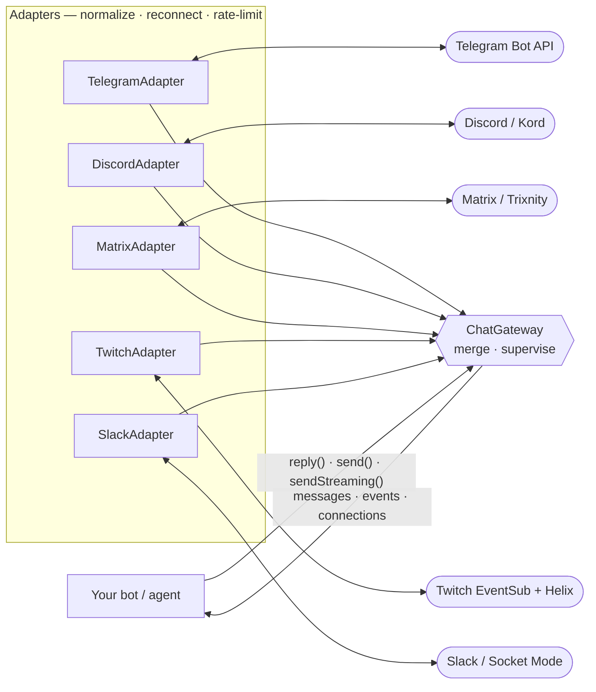
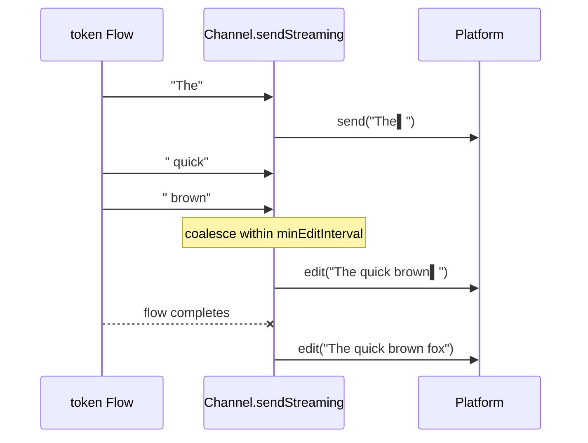
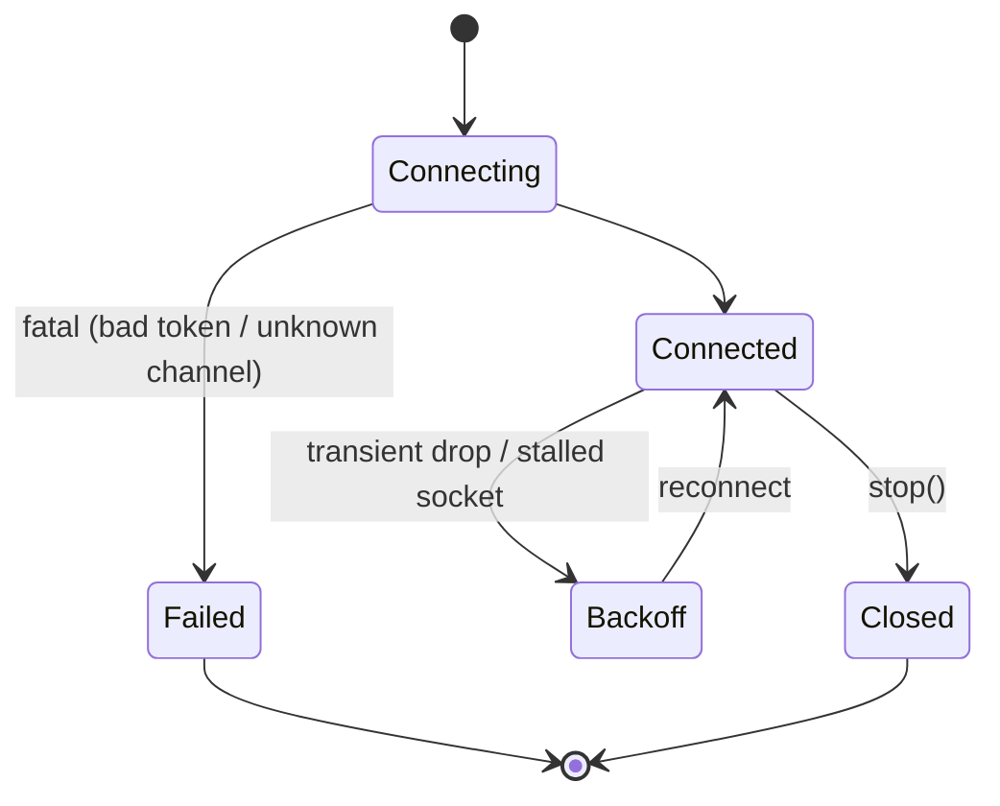

# kurier

> One API for chat platforms. Kotlin-native, coroutine-first.

**kurier** (German/Polish for *courier*) is a unified channel adapter layer for the JVM — think **JDBC for chat platforms**.
Write your bot or agent once against one typed, `Flow`-based API; per-platform adapters handle the rest: message
normalization, rich-text dialects, threading, reconnection, and rate limits.

```kotlin
val gateway = chatGateway {
    install(TelegramAdapter(token = System.getenv("TG_TOKEN")))
    install(DiscordAdapter(token = System.getenv("DISCORD_TOKEN")))
    install(MatrixAdapter(homeserver = System.getenv("MATRIX_HOMESERVER"), accessToken = System.getenv("MATRIX_TOKEN")))
    install(
        TwitchAdapter(
            clientId = System.getenv("TWITCH_CLIENT_ID"),
            accessToken = System.getenv("TWITCH_TOKEN"),
            channel = System.getenv("TWITCH_CHANNEL"),
        ),
    )
    install(
        SlackAdapter(
            botToken = System.getenv("SLACK_BOT_TOKEN"),
            appToken = System.getenv("SLACK_APP_TOKEN"),
        ),
    )
}

gateway.start()
gateway.messages.collect { msg ->
    if (msg.isDirectedAtBot) {
        msg.reply(agent.run(msg.text))      // or reply(tokenFlow) for streaming LLM output
    }
}
```

The same bot now runs on Telegram, Discord, Matrix, Twitch, and Slack — no platform code in your handler.

## Status

🚧 **Pre-alpha.** API design phase; nothing published to Maven Central yet (see [Roadmap](#roadmap)). The gateway runtime
and the in-memory `FakeAdapter` work end-to-end (`./gradlew :samples:echo-bot:run`), and the Telegram, Discord, Matrix,
Twitch, and Slack adapters are functional. Pre-0.1.0 the public API may change without a deprecation cycle.

## Supported platforms

| Platform | Status | Inbound transport | Built on |
|---|---|---|---|
| **Telegram** | ✅ shipped (M1) | Bot API long-polling | Ktor client (direct) |
| **Discord** | ✅ shipped (M2) | Gateway WebSocket | [Kord](https://github.com/kordlib/kord) |
| **Matrix** | ✅ shipped (M2.5) | `/sync` long-poll (no webhook server) | [Trixnity](https://github.com/benkuly/trixnity) |
| **Twitch** | ✅ shipped (M2.9) | EventSub WebSocket + Helix | Ktor client (direct) |
| **Slack** | ✅ shipped (M3) | Socket Mode (no webhook server) | [Slack SDK](https://github.com/slackapi/java-slack-sdk) |
| **Signal** | ⬜ planned (M5) | signal-cli sidecar | — |
| **WhatsApp / LINE** | ⬜ planned (M6) | webhook inbound | — |

Adapters **wrap, never reimplement** — Kord and the Slack SDK do the protocol work. Telegram and Twitch are the two
sanctioned exceptions: their surfaces are small enough to talk to the official API directly over Ktor, which keeps them
thin and Android-safe (Twitch4J would drag in Hystrix/Jackson/`java.time`).

Slack is the only platform needing app-side configuration beyond a token — see the
[Slack setup guide](docs/slack-setup.md) (workspace, Socket Mode, scopes, event subscriptions).

## Architecture



Each adapter owns one platform connection and normalizes it into kurier's model. The **gateway** merges every adapter's
streams behind one API and supervises them: a crash or disconnect on one platform never tears down the others (each
runs under a `SupervisorJob`), and you consume a single `messages` flow regardless of how many platforms are installed.

## Core API

Everything below lives in the **`core`** module — pure Kotlin, coroutines its only dependency.

| Type | What it is |
|---|---|
| `ChatGateway` | Application entry point. Merged `messages` / `events` / `connections` flows; `start()` / `stop()`; `channel(id)` for proactive sends. |
| `IncomingMessage` | A normalized inbound message. `reply()`, `react()`, `text`, `isDirectedAtBot`, `raw`. |
| `Channel` | A conversation you can post to. `send()`, `sendStreaming()`, `supports(Capability)`, `indicateTyping()`. |
| `SentMessage` | A handle to a message you sent. `edit()`, `delete()`. |
| `Content` / `RichText` | Outgoing content + a platform-agnostic rich-text AST (+ a `richText { }` DSL). |
| `Author` | Message sender — `id`, `displayName`, `isBot`. |
| `PlatformId` / `ChannelId` / `MessageId` | Value-class identifiers; channel ids follow `"<platform>:<native id>"`. |
| `Capability` | Optional platform features, queryable via `Channel.supports()`. |
| `ConnectionState` | Per-platform connection lifecycle. |
| `KurierException` | The failure contract: send/edit/delete failures surface as this, portably. `retryable` says whether trying again can succeed; `cause` carries the platform exception. |
| `ChannelAdapter` / `AdapterConnection` | The SPI a platform integration implements. |

### Receiving and replying

```kotlin
public interface ChatGateway {
    val messages: Flow<IncomingMessage>                          // merged across platforms
    val events: Flow<ChannelEvent>                               // deletions, reactions, …
    val connections: StateFlow<Map<PlatformId, ConnectionState>>
    suspend fun start()
    suspend fun stop()
    fun channel(id: ChannelId): Channel?                         // proactive sends (alerts, cron)
}

public interface IncomingMessage {
    val id: MessageId
    val channel: Channel
    val author: Author
    val rich: RichText
    val replyTo: MessageRef?
    val isDirectedAtBot: Boolean                                 // DM, @-mention, or reply to the bot
    val raw: Any?                                                // escape hatch (see below)

    suspend fun reply(content: Content): SentMessage
    suspend fun reply(tokens: Flow<String>, options: StreamingOptions = StreamingOptions.Default): SentMessage
    suspend fun react(emoji: String)                            // no-op where unsupported
}

val IncomingMessage.text: String                                // plain-text projection of rich
suspend fun IncomingMessage.reply(text: String): SentMessage   // convenience overload
```

`isDirectedAtBot` lets one handler serve both DMs (always directed) and busy group channels (act only when mentioned).
Delivery is never gated on it — you receive every message the platform hands the adapter; the flag is just metadata.

### Sending and rich text

`Content` carries a platform-agnostic [`RichText`](core/src/main/kotlin/kurier/RichText.kt) AST. Each adapter renders it
to the native dialect (Telegram entities, Discord markdown, Matrix HTML, Slack mrkdwn) — kurier never emits raw markup,
so there is no formatting-injection surface.

```kotlin
channel.send("plain text")                                      // String convenience
channel.send(Content.rich { bold("done "); code("build #42") }) // typed DSL

// RichText node types: Text, Bold, Italic, Code, CodeBlock(language?), Link(url, label?)
```

### Streaming-edit replies (the flagship feature)

`reply(tokens: Flow<String>)` progressively **edits one message** as LLM tokens arrive — the "message types itself"
effect — throttled to each platform's safe edit rate. On platforms without `Capability.EDITING` (e.g. Twitch) it
transparently degrades to a single buffered send.



```kotlin
public data class StreamingOptions(
    val mode: StreamingMode = StreamingMode.EDIT,   // or BUFFERED
    val minEditInterval: Duration = 1.seconds,      // adapters clamp to platform limits
    val cursor: String? = "▌",                      // shown while streaming, stripped at the end
)
```

The token stream's pace is fully decoupled from the platform edit rate: tokens accumulate continuously while edits fire
no faster than `minEditInterval`, and a trailing edit always lands the complete text. Adapters get this for free by
delegating to the shared `Channel.sendStreamingByEditing(...)` engine in `core`.

### Capabilities

Optional features are **queried, not assumed** — `channel.supports(Capability.BUTTONS)` — and unsupported operations
degrade to no-ops instead of throwing. No lowest-common-denominator API.

| Capability | Telegram | Discord | Matrix | Twitch | Slack |
|---|:-:|:-:|:-:|:-:|:-:|
| Text + rich text | ✅ | ✅ | ✅ | ✅ (plain) | ✅ |
| `EDITING` — streaming edits | ✅ | ✅ | ✅ | — *(buffers)* | ✅ |
| `REACTIONS` | ✅ | ✅ | ✅ | — | ✅² |
| `TYPING` | ✅ | ✅ | ✅ | — | — |
| `FILES` | —¹ | —¹ | —¹ | — | —¹ |
| `BUTTONS` | —¹ | —¹ | — | — | —¹ |
| `THREADS` | —¹ | ✅ | —¹ | — | —¹ |
| `VOICE` | —¹ | — | —¹ | — | — |

¹ Provisional `false`: the platform has the feature but the adapter hasn't wired it yet — outbound file and button
support lands post-0.1.0, flipping these to ✅ additively. `supports()` only reports what works through kurier today.
² `react(emoji)` takes canonical **unicode** (`"👍"`) everywhere and never throws — platform-rejected emoji degrade to
a no-op. The Slack adapter translates a common set to and from shortcodes; unmapped emoji no-op outbound, and custom
workspace emoji surface by name inbound.

### Connection lifecycle

`gateway.connections` exposes each platform's state; adapters own reconnection and backoff internally.



### Escape hatch

Agnostic by default, never trapped: every `IncomingMessage` exposes the underlying platform object via `raw: Any?` for
the rare case you need a platform-only field. SDK types never leak into `core` signatures — they're reachable only
through `raw` (and, per adapter, typed accessors as those land).

### Writing an adapter ([SPI](https://en.wikipedia.org/wiki/Service_provider_interface))

An adapter implements two interfaces and normalizes its platform into kurier's model. It owns reconnection, backoff, and
rate limiting; the gateway just merges what it emits.

```kotlin
public interface ChannelAdapter {
    val platform: PlatformId
    fun connect(scope: CoroutineScope): AdapterConnection
}

public interface AdapterConnection {
    val messages: Flow<IncomingMessage>
    val events: Flow<ChannelEvent>
    val state: StateFlow<ConnectionState>
    fun channel(id: ChannelId): Channel?   // for proactive sends; null if unknown
    suspend fun close()
}
```

Prove conformance with the shared suite: add `testImplementation("com.eventslooped:kurier-testing-contract:<version>")`,
subclass `ChannelContract`, and the same invariants that gate the bundled adapters (streaming degradation, the
`KurierException` error contract, no-op capability fallbacks) run against your adapter.

## Modules

| Module | Role | Key constraint |
|---|---|---|
| `core` | Public API + adapter SPI | Pure Kotlin; coroutines the only dependency; KMP-promotable |
| `runtime` | `chatGateway {}` DSL + gateway (supervision, flow merging) | Depends only on `core` |
| `adapter-telegram` | Telegram Bot API over Ktor | — |
| `adapter-discord` | Discord via Kord | — |
| `adapter-matrix` | Matrix via Trixnity (`/sync`) | — |
| `adapter-twitch` | Twitch EventSub + Helix over Ktor | — |
| `adapter-slack` | Slack via Socket Mode (Slack SDK, Java-WebSocket backend) | — |
| `testing` | `FakeAdapter` / `FakeChannel` for unit-testing bots | Published artifact, not test-only; framework-free |
| `testing-contract` | Shared SPI conformance suite (`ChannelContract`) + rendering-matrix samples | Published artifact; JUnit5-bound, consumed as a test dependency |
| `samples/echo-bot` | Runnable end-to-end demo (no tokens required) | Exempt from library rules |

Published as `com.eventslooped:kurier-core`, `kurier-runtime`, `kurier-adapter-*`, `kurier-testing`,
`kurier-testing-contract` (coordinates reserved; first publish is 0.1.0 in M4). Code packages live under the bare brand `kurier`: core owns the bare package,
every other artifact owns `kurier.<module>` (`kurier.runtime`, `kurier.telegram`, …).

## Testing your bot

The `testing` artifact ships `FakeAdapter`, so bot logic is unit-testable with **no network, no tokens, no sleeps** —
synchronization is structural, not timing-based.

```kotlin
val fake = FakeAdapter(id = "test", onSend = { _, content -> sent += content.text })
val gateway = chatGateway { install(fake) }
gateway.start()
fake.receive("ping")                 // suspends until the gateway is subscribed
// assert on what the bot sent
```

## Build

```bash
./gradlew build                                # compile + tests + ktlint + detekt
./gradlew :samples:echo-bot:run                # interactive demo; reads tokens (TG_TOKEN, SLACK_BOT_TOKEN, …) from env vars or a repo-root .env
printf "hi\n" | ./gradlew :samples:echo-bot:run -q   # non-interactive smoke test (in-memory)
```

## Roadmap

- **M1** — Telegram adapter ✔️
- **M2** — Discord adapter + streaming-edit replies ✔️
- **M2.5** — Matrix adapter (Trixnity, `/sync`) ✔️
- **M2.9** — Twitch adapter (EventSub + Helix) ✔️
- **M3** — Slack adapter (Socket Mode) + rich-text rendering matrix + shared SPI contract tests ✔️
- **M4** — docs + **0.1.0 on Maven Central**
- **M5** — Signal (signal-cli sidecar)
- **M6** — WhatsApp + LINE (webhook-inbound abstraction + send-window capability)

## License

[Apache 2.0](LICENSE)
