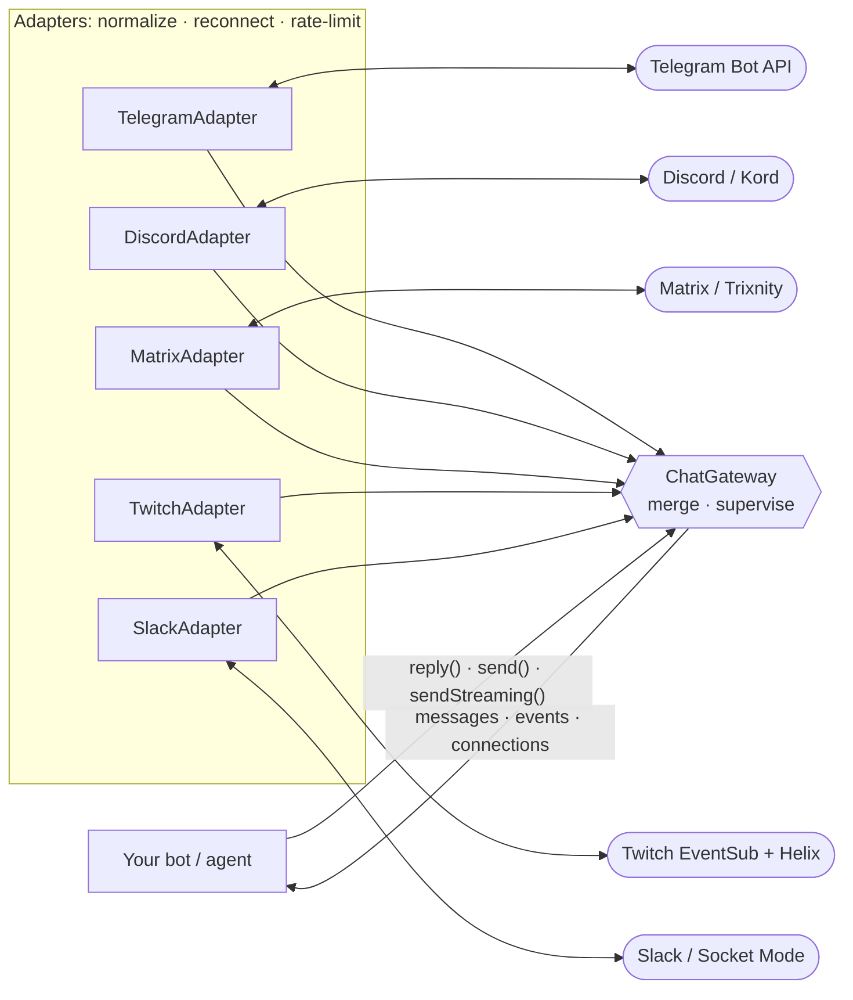
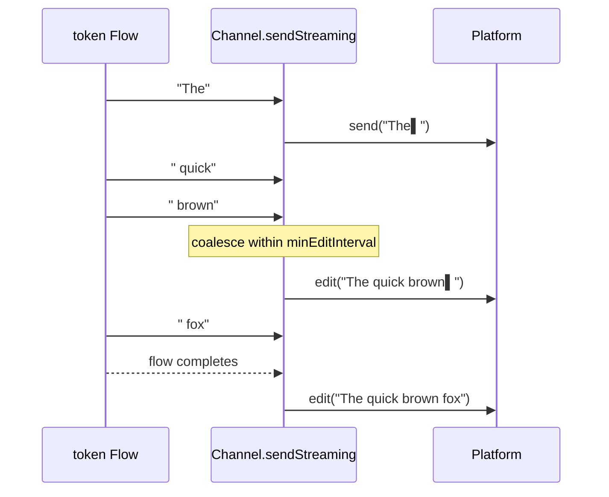
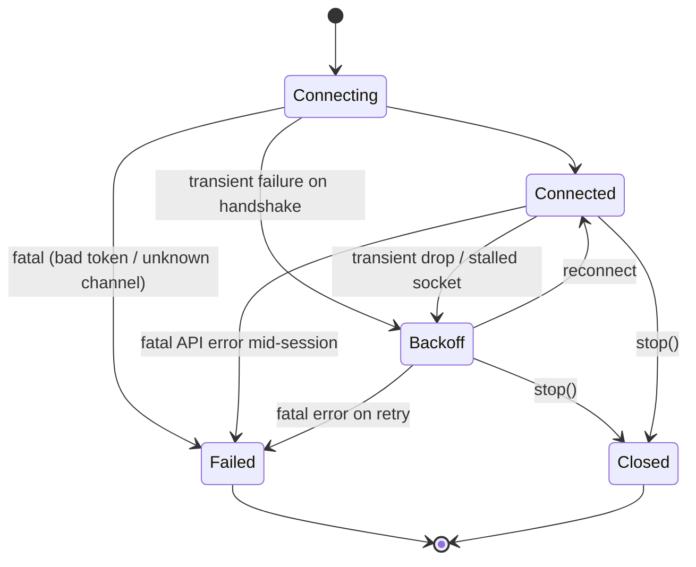

# kurier

[](https://github.com/inemtsev/kurier/actions/workflows/ci.yml)
[](https://central.sonatype.com/search?namespace=com.eventslooped)
[](https://kotlinlang.org)
[](https://www.apache.org/licenses/LICENSE-2.0)

> One API for chat platforms. Kotlin-native, coroutine-first.

Writing a chat bot is fun. Writing the same bot a second time, because half your users live on Discord and the other
half on Telegram, is not. **kurier** (German/Polish for *courier*) fixes this the way JDBC fixed databases: you write
your bot or agent once against one typed, `Flow`-based API, and per-platform adapters do the unglamorous work of
message normalization, rich-text dialects, threading, reconnection, and rate limits.

Let's wire the same bot to five platforms:

```kotlin
val gateway = chatGateway {
    install(TelegramAdapter(token = System.getenv("TG_TOKEN")))
    install(DiscordAdapter(token = System.getenv("DISCORD_TOKEN")))
    install(MatrixAdapter(homeserver = System.getenv("MATRIX_HOMESERVER"), accessToken = System.getenv("MATRIX_TOKEN")))
    install(
        TwitchAdapter(
            clientId = System.getenv("TWITCH_CLIENT_ID"),
            accessToken = System.getenv("TWITCH_TOKEN"),
            channel = System.getenv("TWITCH_CHANNEL"),
        ),
    )
    install(
        SlackAdapter(
            botToken = System.getenv("SLACK_BOT_TOKEN"),
            appToken = System.getenv("SLACK_APP_TOKEN"),
        ),
    )
}

gateway.start()
gateway.messages.collect { msg ->
    if (msg.isDirectedAtBot) {
        msg.reply(agent.run(msg.text))      // or reply(tokenFlow) for streaming LLM output
    }
}
```

That's the whole bot. It now runs on Telegram, Discord, Matrix, Twitch, and Slack, with no platform-specific code in
the handler.

Two things worth knowing before you build on this. First, `messages` is a hot flow with no replay, so start collecting
before (or immediately after) `start()`. Second, a sequential `collect` serializes handling across *all* platforms;
launch a coroutine per message for slow work (replies, LLM calls) so one platform's slow reply never stalls the rest.

## Status

**0.1.0, the first public release**, is on Maven Central. All five adapters are functional, the public API surface is
locked by a binary-compatibility check, and breaking changes go through a deprecation cycle. Pre-1.0, minor releases
still evolve the API, additively.

## Install

```kotlin
dependencies {
    implementation("com.eventslooped:kurier-runtime:0.1.0")            // gateway (brings kurier-core transitively)
    implementation("com.eventslooped:kurier-adapter-telegram:0.1.0")   // one artifact per platform you target
    testImplementation("com.eventslooped:kurier-testing:0.1.0")        // FakeAdapter, for testing your bot
}
```

Adapter artifacts: `kurier-adapter-telegram`, `-discord`, `-matrix`, `-twitch`, `-slack`. Writing your own adapter?
Add `com.eventslooped:kurier-testing-contract` (test scope) for the shared conformance suite.

## Supported platforms

| Platform | Status | Inbound transport | Built on |
|---|---|---|---|
| **Telegram** | ✅ shipped | Bot API long-polling | Ktor client (direct) |
| **Discord** | ✅ shipped | Gateway WebSocket | [Kord](https://github.com/kordlib/kord) |
| **Matrix** | ✅ shipped | `/sync` long-poll (no webhook server) | [Trixnity](https://github.com/benkuly/trixnity) |
| **Twitch** | ✅ shipped | EventSub WebSocket + Helix | Ktor client (direct) |
| **Slack** | ✅ shipped | Socket Mode (no webhook server) | [Slack SDK](https://github.com/slackapi/java-slack-sdk) |
| **Signal** | ⬜ planned | signal-cli sidecar | - |
| **WhatsApp / LINE** | ⬜ planned | webhook inbound | - |

Adapters **wrap, never reimplement**: Kord and the Slack SDK do the protocol work. Telegram and Twitch are the two
sanctioned exceptions. Their API surfaces are small enough to talk to directly over Ktor, which keeps those adapters
thin and Android-safe (Twitch4J would drag in Hystrix, Jackson, and `java.time`).

Slack is the only platform that needs app-side configuration beyond a token; the
[Slack setup guide](docs/slack-setup.md) walks through the workspace, Socket Mode, scopes, and event subscriptions.
Discord has exactly one required portal toggle (the Message Content privileged intent); the
[Discord setup guide](docs/discord-setup.md) covers the token, intents, invite URL, and close code 4014.

## Architecture


```mermaid
flowchart LR
    APP["Your bot / agent"]
    GW{{"ChatGateway<br/>merge · supervise"}}

    subgraph ADAPTERS["Adapters: normalize · reconnect · rate-limit"]
        A1["TelegramAdapter"]
        A2["DiscordAdapter"]
        A3["MatrixAdapter"]
        A4["TwitchAdapter"]
        A5["SlackAdapter"]
    end

    A1 <--> P1(["Telegram Bot API"])
    A2 <--> P2(["Discord / Kord"])
    A3 <--> P3(["Matrix / Trixnity"])
    A4 <--> P4(["Twitch EventSub + Helix"])
    A5 <--> P5(["Slack / Socket Mode"])

    A1 --> GW
    A2 --> GW
    A3 --> GW
    A4 --> GW
    A5 --> GW

    GW -->|"messages · events · connections"| APP
    APP -->|"reply() · send() · sendStreaming()"| GW
```

Each adapter owns one platform connection and normalizes it into kurier's model. The **gateway** merges every adapter's
streams behind one API and supervises them: a crash or disconnect on one platform never tears down the others (each
runs under a `SupervisorJob`), and you consume a single `messages` flow no matter how many platforms are installed.

## Core API

Everything below lives in the **`core`** module. Pure Kotlin, coroutines its only dependency.

| Type | What it is |
|---|---|
| `ChatGateway` | Application entry point. Merged `messages` / `events` / `connections` flows; `start()` / `stop()`; `channel(id)` for proactive sends. |
| `IncomingMessage` | A normalized inbound message. `reply()`, `react()`, `text`, `isDirectedAtBot`, `raw`. |
| `Channel` | A conversation you can post to. `send()`, `sendStreaming()`, `supports(Capability)`, `indicateTyping()`. |
| `SentMessage` | A handle to a message you sent. `edit()`, `delete()`. |
| `Content` / `RichText` | Outgoing content + a platform-agnostic rich-text AST (+ a `richText { }` DSL). |
| `Author` | Message sender: `id`, `displayName`, `isBot`. |
| `PlatformId` / `ChannelId` / `MessageId` | Value-class identifiers; channel ids follow `"<platform>:<native id>"`. |
| `Capability` | Optional platform features, queryable via `Channel.supports()`. |
| `ConnectionState` | Per-platform connection lifecycle. |
| `KurierException` | The failure contract: send/edit/delete failures surface as this, portably. `retryable` says whether trying again can succeed; `cause` carries the platform exception. |
| `ChannelAdapter` / `AdapterConnection` | The SPI a platform integration implements. |

### Receiving and replying

```kotlin
public interface ChatGateway {
    val messages: Flow<IncomingMessage>                          // merged across platforms
    val events: Flow<ChannelEvent>                               // deletions, reactions, …
    val connections: StateFlow<Map<PlatformId, ConnectionState>>
    suspend fun start()
    suspend fun stop()
    fun channel(id: ChannelId): Channel?                         // proactive sends (alerts, cron)
}

public interface IncomingMessage {
    val id: MessageId
    val channel: Channel
    val author: Author
    val rich: RichText
    val replyTo: MessageRef?                                     // thread root on Slack; the exact replied-to message elsewhere
    val isDirectedAtBot: Boolean                                 // DM, @-mention, or reply to the bot
    val raw: Any?                                                // escape hatch (see below)

    suspend fun reply(content: Content): SentMessage             // native reply-linking: Telegram reply, Discord reference, Slack thread
    suspend fun reply(tokens: Flow<String>, options: StreamingOptions = StreamingOptions.Default): SentMessage
    suspend fun react(emoji: String)                            // no-op where unsupported
}

val IncomingMessage.text: String                                // plain-text projection of rich
suspend fun IncomingMessage.reply(text: String): SentMessage   // convenience overload
```

`isDirectedAtBot` lets one handler serve both DMs (always directed) and busy group channels (act only when mentioned).
Delivery is never gated on it: you receive every message the platform hands the adapter, minus the bot's own echoes;
the flag is just metadata. Precision varies by platform. Telegram and Discord are exact (DM, direct reply, structured
mention); on Slack every message in a thread rooted at one of the bot's messages counts; Matrix uses an mxid-substring
heuristic (DM rooms are not detected yet); Twitch detects structured mentions only.

### Sending and rich text

`Content` carries a platform-agnostic [`RichText`](core/src/main/kotlin/kurier/RichText.kt) AST, and each adapter
renders it to the native dialect (Telegram entities, Discord markdown, Matrix HTML, Slack mrkdwn). kurier never emits
raw markup, so there is no formatting-injection surface: a user who names themselves `**bold**` stays plain text
instead of shouting.

```kotlin
channel.send("plain text")                                      // String convenience
channel.send(Content.rich { bold("done "); code("build #42") }) // typed DSL

// RichText node types: Text, Bold, Italic, Strikethrough, Code, CodeBlock(language?), Link(url, label?)
```

### Streaming-edit replies

This is the flagship feature. `reply(tokens: Flow<String>)` progressively **edits one message** as LLM tokens arrive,
giving the "message types itself" effect, throttled to each platform's safe edit rate. On platforms without
`Capability.EDITING` (Twitch, for one) it degrades to a single buffered send and keeps a typing indicator alive while
it drains.


```mermaid
sequenceDiagram
    participant LLM as token Flow
    participant CH as Channel.sendStreaming
    participant P as Platform
    LLM->>CH: "The"
    CH->>P: send("The▌")
    LLM->>CH: " quick"
    LLM->>CH: " brown"
    Note over CH: coalesce within minEditInterval
    CH->>P: edit("The quick brown▌")
    LLM->>CH: " fox"
    LLM-->>CH: flow completes
    CH->>P: edit("The quick brown fox")
```

```kotlin
public class StreamingOptions(
    val mode: StreamingMode = StreamingMode.EDIT,   // or BUFFERED
    val minEditInterval: Duration = 1.seconds,      // a lower bound; adapters raise it to their platform minimum
    val cursor: String? = "▌",                      // shown while streaming, stripped at the end
    val replyTo: MessageRef? = null,                // reply-link the streamed message
)
```

The token stream's pace is fully decoupled from the platform edit rate: tokens accumulate continuously while edits fire
no faster than `minEditInterval`, and a trailing edit lands the complete text. If the token flow dies mid-stream, the
partial message is finalized with the text received so far (cursor stripped) and the original exception is rethrown.
Adapters get all of this for free by delegating to the shared `Channel.sendStreamingByEditing(...)` engine in `core`.

To see this driving a real LLM end to end, see
[kurier-concierge](https://github.com/inemtsev/kurier-concierge): a complete worked example that runs a
[Koog](https://github.com/JetBrains/koog) agent with a RAG knowledge base and streams its answers on Telegram,
Discord, and Slack from one process.

### Capabilities

Optional features are queried, not assumed: `channel.supports(Capability.BUTTONS)`. Unsupported operations degrade to
no-ops instead of throwing, and there is no lowest-common-denominator API.

| Capability | Telegram | Discord | Matrix | Twitch | Slack |
|---|:-:|:-:|:-:|:-:|:-:|
| Text + rich text | ✅ | ✅ | ✅ | ✅ (plain) | ✅ |
| `EDITING` (streaming edits) | ✅ | ✅ | ✅ | - *(buffers)* | ✅ |
| `REACTIONS` | ✅ | ✅ | ✅ | - | ✅² |
| `TYPING` | ✅ | ✅ | ✅ | - | - |
| `FILES` | -¹ | -¹ | -¹ | - | -¹ |
| `BUTTONS` | -¹ | -¹ | - | - | -¹ |
| `THREADS` | -¹ | ✅ | -¹ | - | -¹ |
| `VOICE` | -¹ | - | -¹ | - | - |

¹ Provisional `false`: the platform has the feature but the adapter hasn't wired it yet. Outbound file and button
support lands post-0.1.0, flipping these to ✅ additively; `supports()` only reports what works through kurier today.
² `react(emoji)` takes canonical **unicode** (`"👍"`) everywhere and never throws; platform-rejected emoji degrade to
a no-op. The Slack adapter translates a common set to and from shortcodes: unmapped emoji no-op outbound, and custom
workspace emoji surface by name inbound.

### Connection lifecycle

`gateway.connections` exposes each platform's state; adapters own reconnection and backoff internally.


```mermaid
stateDiagram-v2
    [*] --> Connecting
    Connecting --> Connected
    Connecting --> Backoff: transient failure on handshake
    Connecting --> Failed: fatal (bad token / unknown channel)
    Connected --> Backoff: transient drop / stalled socket
    Connected --> Failed: fatal API error mid-session
    Backoff --> Connected: reconnect
    Backoff --> Failed: fatal error on retry
    Backoff --> Closed: stop()
    Connected --> Closed: stop()
    Failed --> [*]
    Closed --> [*]
```

### Escape hatch

Agnostic by default, never trapped: every `IncomingMessage` exposes the underlying platform object via `raw: Any?` for
the rare case you need a platform-only field. SDK types never leak into `core` signatures; they're reachable only
through `raw` (and, per adapter, typed accessors as those land).

### Writing an adapter ([SPI](https://en.wikipedia.org/wiki/Service_provider_interface))

An adapter implements two interfaces and normalizes its platform into kurier's model. It owns reconnection, backoff,
and rate limiting; the gateway just merges what it emits.

```kotlin
public interface ChannelAdapter {
    val platform: PlatformId
    fun connect(scope: CoroutineScope): AdapterConnection
}

public interface AdapterConnection {
    val messages: Flow<IncomingMessage>
    val events: Flow<ChannelEvent>
    val state: StateFlow<ConnectionState>
    fun channel(id: ChannelId): Channel?   // for proactive sends; null only for foreign or malformed ids
    suspend fun close()
}
```

The contract in brief (the full version lives in the `AdapterConnection` KDoc): `connect` returns immediately and
launches all work into the given scope; `messages`/`events` are hot, non-replaying, multicast-safe, and never complete
exceptionally. Failures surface through `state` (`Connecting → Connected`, transient drops to `Backoff`, `Failed`
terminal, `Closed` via `close()`). One invariant deserves bold: **`messages` and `events` must exclude the bot's own
traffic.** Most platforms echo the bot's posts and reactions back, and forwarding them creates an infinite self-reply
loop; every in-repo adapter filters by the authenticated self id. Channel ids are `<platform>:<native id>`; build them
with `ChannelId.of` and parse them with `ChannelId.nativeId`.

Adapter entry points follow one convention (see the five bundled adapters): a plain class with a plain constructor,
no builders, no config objects. Required credentials come first as `String` parameters, validated eagerly with
`require(...)` so misconfiguration fails at construction, not at connect; optional platform config follows with
defaults; and the last parameter is always `id: String = "<platform>"` so multiple instances of one platform can run
side by side. New parameters are added with defaults *before* the trailing `id`; pass `id` (and same-typed credential
pairs) by name.

To prove conformance, add `testImplementation("com.eventslooped:kurier-testing-contract:<version>")` and subclass
`ChannelContract`: the same invariants that gate the bundled adapters (streaming degradation, the `KurierException`
error contract, no-op capability fallbacks) then run against yours.

## Modules

| Module | Role | Key constraint |
|---|---|---|
| `core` | Public API + adapter SPI | Pure Kotlin; coroutines the only dependency; KMP-promotable |
| `runtime` | `chatGateway {}` DSL + gateway (supervision, flow merging) | Depends only on `core` |
| `adapter-telegram` | Telegram Bot API over Ktor | - |
| `adapter-discord` | Discord via Kord | - |
| `adapter-matrix` | Matrix via Trixnity (`/sync`) | - |
| `adapter-twitch` | Twitch EventSub + Helix over Ktor | - |
| `adapter-slack` | Slack via Socket Mode (Slack SDK, Java-WebSocket backend) | - |
| `testing` | `FakeAdapter` / `FakeChannel` for unit-testing bots | Published artifact, not test-only; framework-free |
| `testing-contract` | Shared SPI conformance suite (`ChannelContract`) + rendering-matrix samples | Published artifact; JUnit5-bound, consumed as a test dependency |
| `samples/echo-bot` | Runnable end-to-end demo (no tokens required) | Exempt from library rules |

Published as `com.eventslooped:kurier-core`, `kurier-runtime`, `kurier-adapter-*`, `kurier-testing`,
`kurier-testing-contract`. Code packages live under the bare brand `kurier`: core owns the bare package,
every other artifact owns `kurier.<module>` (`kurier.runtime`, `kurier.telegram`, …).

## Testing your bot

The `testing` artifact ships `FakeAdapter`, so bot logic is unit-testable with no network, no tokens, and no sleeps.
Synchronization is structural, not timing-based:

```kotlin
val fake = FakeAdapter(id = "test", onSend = { _, content -> sent += content.text })
val gateway = chatGateway { install(fake) }
gateway.start()
fake.receive("ping")                 // suspends until the gateway is subscribed
// assert on what the bot sent
```

## Build

```bash
./gradlew build                                # compile + tests + ktlint + detekt
./gradlew :samples:echo-bot:run                # interactive demo; reads tokens (TG_TOKEN, SLACK_BOT_TOKEN, …) from env vars or a repo-root .env
printf "hi\n" | ./gradlew :samples:echo-bot:run -q   # non-interactive smoke test (in-memory)
```

## Contributing

Pull requests welcome: see [CONTRIBUTING.md](CONTRIBUTING.md) for the build gate, code style, and
API-stability rules, and [CHANGELOG.md](CHANGELOG.md) for what changed when. Planning to add a
platform adapter? Start with the [SPI section](#writing-an-adapter-spi) above.

## License

[Apache 2.0](LICENSE)
